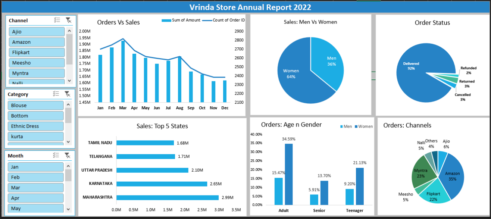

# Vrinda Store Annual Sales Report 2022

 <!-- Replace with your converted image -->

## Description  
Annual sales report for Vrinda Store (2022) analyzing sales distribution across channels, categories, demographics (gender, age), and regional performance (states).

## Key Metrics  
- **Top Channels**: Amazon, Flipkart, Myntra  
- **Top Categories**: Ethnic Dress, Blouse, Bottom  
- **Top States**: Tamil Nadu, Telangana, Karnataka  
- **Gender Distribution**: 64% Male, 36% Female  
- **Age Groups**: Adult (40%), Senior (35%), Teenager (25%)  

## Data Highlights  
- **Total Sales**: ₹3.00M+  
- **Order Status**:  
  - Delivered: 92%  
  - Refunded: 4%  
  - Returned: 3%  
  - Cancelled: 1%  
- **Top Performing State**: Karnataka (₹2.65M)  
- **Top Channel**: Amazon (₹2.00M)  
- **Top Category**: Ethnic Dress (34.59%)  

## Languages and Utilities Used  
- Microsoft Excel (Pivot Tables, Charts, Formulas)  
- Data Visualization: Bar charts, pie charts, line graphs  

## Environments Used  
- Microsoft Excel (Windows)  

